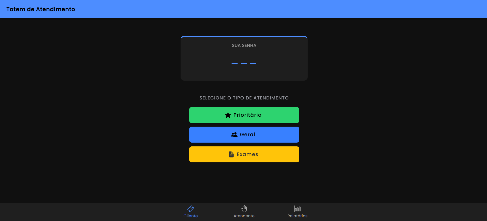
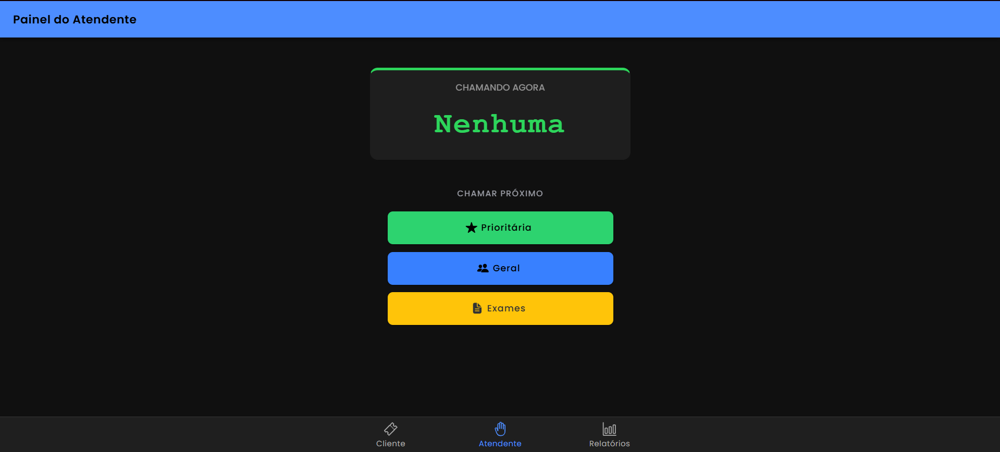
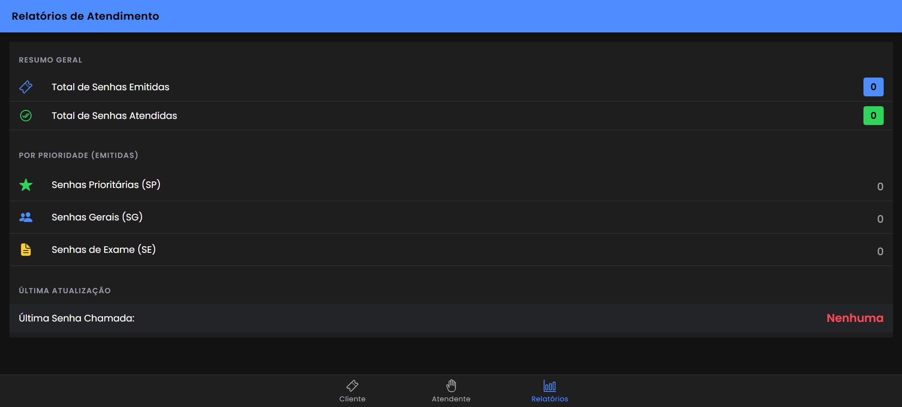

# 🏥 Projeto Ionic | Sistema de Atendimento Laboratorial
`Imagens Ilustrativas`

### Totem de Autoatendimento

Interface destinada ao cliente para a emissão de senhas. Permite a escolha entre as categorias Prioritária, Geral e Exames, gerando o código único no padrão solicitado

### Painel do Atendente

Tela de controle para o funcionário do laboratório. Exibe a senha que está sendo chamada no momento e possui botões para convocar o próximo paciente de cada fila específica.

### Dashboard de Relatórios

Tela de controle para o funcionário do laboratório. Exibe a senha que está sendo chamada no momento e possui botões para convocar o próximo paciente de cada fila específica.

##

O **InfoLab Health** é uma aplicação mobile híbrida desenvolvida para gerenciar de forma eficiente o fluxo de pacientes em um laboratório clínico. 
O projeto foi construído com Ionic e Angular, permitindo que o totem de autoatendimento, o painel do atendente e os relatórios administrativos funcionem de forma integrada e em tempo real.


##  Funcionalidades Principais
- **Seleção de Categorias:**
O usuário pode escolher entre três tipos de atendimento: Prioritária (SP), Geral (SG) ou Exames (SE).

- **Geração Automática de Senhas:**
O sistema gera códigos seguindo o padrão técnico rigoroso: `YYMMDD-PPSQ` (Data atual + Prefixo da Categoria + Sequência).

- **Painel de Chamada (Atendente):**
Um painel exclusivo onde o atendente visualiza a senha atual e chama o próximo paciente da fila de cada categoria utilizando a lógica `First-In, First-Out` (FIFO).

- **Relatórios de Atendimento:**
Painel administrativo que exibe o quantitativo detalhado:
  - Total de senhas emitidas por categoria.

  - Total geral de senhas emitidas.

  - Total de senhas que já foram atendidas.

- **Persistência com Services:**
Uso de `Injectable Services` do Angular para manter o estado dos dados globalmente, permitindo que a troca de abas não resete os contadores ou as filas.

- **Interface Amigável**
Estilo moderno e clean utilizando a fonte Poppins, com cores padronizadas para cada tipo de prioridade, garantindo acessibilidade e clareza.

## 🛠️ Tecnologias Utilizadas
- **Frontend:**
  - Ionic Framework 
  - TypeScript
  - SCSS (Custom Styling)
  - Angular
  

##  Como Executar o Projeto
Siga os passos abaixo para configurar e rodar o projeto localmente.

### Pré-requisitos
- Node.js (versão 18 ou superior)
- Git
- Ionic CLI instalado (`npm install -g @ionic/cli`)

### 1. Clone o Repositório
```
https://github.com/AnnaLuiza-sb/MobileTicketsIonic.git
```
### 2. Instale as Dependências

```
npm install
```
### 3. Inicie o Servidor de Desenvolvimento

```
ionic serve
```

## 👩🏽‍💻  Colaboradores

- **Anna Luiza Gomes Sobral - 01747584**
- **Maria Clara Matos Duarte - 01747494**
- **Wiviam Eshley Anacleto da Silva - 01751563**

## 📜 Licença
Este projeto está licenciado sob a [Licença MIT](LICENSE). Veja o arquivo LICENSE para mais detalhes.
