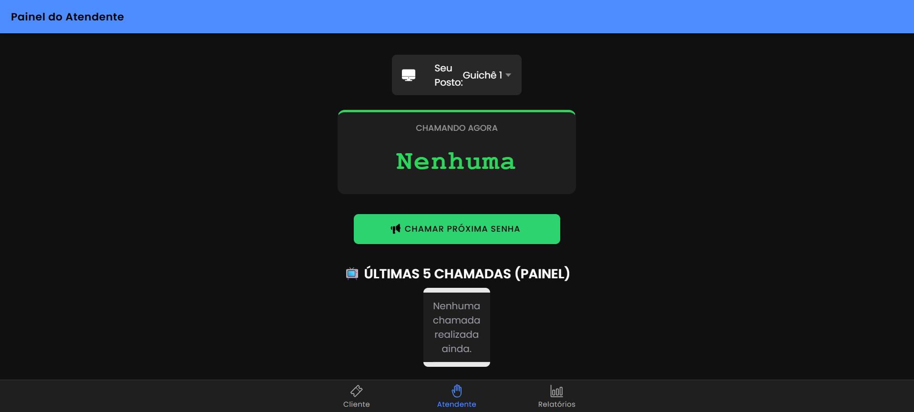

# #  Projeto Ionic | Sistema de Controle de Atendimento (GAP)
`Imagens Ilustrativas`

### Totem de Autoatendimento

Interface destinada ao cliente para a emissão de senhas. Permite a escolha entre as categorias Prioritária (SP), Geral (SG) e Exames (SE), integrando diretamente com a API REST para gerar o código único no padrão solicitado.

### Painel do Atendente

Tela de controle para o funcionário do laboratório. Comunica-se com o back-end para convocar o próximo paciente respeitando a regra de alternância de prioridades e simula as taxas de desistência do sistema.

### Dashboard de Relatórios

Painel gerencial administrativo focado em métricas. Exibe dados consolidados em tempo real fornecidos pela API, como o total de emissões, atendimentos com sucesso, desistências e cálculo automático do tempo médio ponderado.

##

O **InfoLab Health** é uma aplicação em arquitetura cliente-servidor desenvolvida para gerenciar de forma eficiente o fluxo de pacientes em um laboratório clínico. 
O ecossistema é composto por um front-end híbrido construído com **Ionic e Angular** e um back-end (servidor REST) robusto construído em **Node.js e Express**, garantindo o processamento de regras de negócios avançadas e centralizadas de forma integrada e em tempo real.

## 🚀 Funcionalidades Evoluídas (GAPs Implementados)

- **Arquitetura Desacoplada (Cliente-Servidor):** Toda a inteligência de dados, controle de filas, horários e geração de códigos foi transferida para uma API REST externa em Node.js, deixando o aplicativo Ionic responsável apenas pela camada de apresentação.

- **Geração Automática de Senhas Dinâmicas:**
  O servidor gera códigos seguindo o padrão técnico rigoroso: `YYMMDD-PPSQ` (Data atual + Prefixo da Categoria + Sequência com 2 dígitos), controlados pelo estado do back-end.

- **Regra de Desistência Automática (Probabilidade Real):**
  Implementação matemática de desistência (GAP de 5%). Ao chamar uma senha, o sistema roda uma verificação de probabilidade. Caso sorteado, o paciente é marcado como "NÃO COMPARECEU", afetando os relatórios gerenciais de forma realista.

- **Cálculo de Tempo de Atendimento Realístico:**
  Simulação de tempos médios baseada em comportamento operacional real do laboratório:
  - **Senha Geral (SG):** Variação matemática de 5 a 11 minutos.
  - **Senha Prioritária (SP):** Variação matemática de 10 a 25 minutos.
  - **Exames (SE):** 95% de chance de durar 1 minuto e 5% de durar 5 minutos.

- **Histórico do Painel (Fila FIFO):**
  Estrutura de dados que armazena na memória do servidor e exibe um histórico contínuo das últimas 5 senhas chamadas no painel principal.

- **Bloqueio por Horário de Expediente:**
  Trava de segurança que impede a emissão de senhas pelo Totem fora do horário regulamentar de atendimento (07:00h às 17:00h).

- **Dashboard Gerencial Analítico:**
  Apresentação de relatórios estatísticos puxados da rota `/api/senhas/relatorios`, contabilizando quantitativo por categoria, total de desistências e a média geral ponderada de tempo de atendimento.

## 🛠️ Tecnologias Utilizadas

- **Frontend:**
  - Ionic Framework 
  - Angular
  - TypeScript
  - SCSS (Custom Styling)

- **Backend (API REST):**
  - Node.js
  - Express
  - CORS (Cross-Origin Resource Sharing)

## ⚙️ Como Executar o Projeto

Siga os passos abaixo para configurar e rodar o front-end e a API localmente na sua máquina.

### Pré-requisitos
- Node.js (versão 18 ou superior)
- Git
- Ionic CLI instalado globalmente (`npm install -g @ionic/cli`)

### 1. Clone o Repositório
```bash
git clone [https://github.com/AnnaLuiza-sb/MobileTicketsIonic.git](https://github.com/AnnaLuiza-sb/MobileTicketsIonic.git)

````

### 2. Configurar e ligar o Back-End e Instalar as Dependências

```
cd api-servidor

npm install

node server.js
```
### 3. instalar as dependências do Servidor de Desenvolvimento e dar início (Front-end)

```
npm install (faça um segundo terminal na raiz do projeto )

ionic serve
```

## 👩🏽‍💻  Colaboradores

- **Anna Luiza Gomes Sobral - 01747584**
- **Maria Clara Matos Duarte - 01747494**
- **Wiviam Eshley Anacleto da Silva - 01751563**
- **Kledson Tenório dos Santos - 01750385**

## 📜 Licença
Este projeto está licenciado sob a [Licença MIT](LICENSE). Veja o arquivo LICENSE para mais detalhes.
